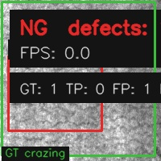
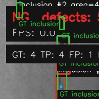
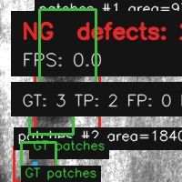

# Industrial Vision Defect System

A C++ industrial surface defect inspection system based on YOLOv12, ONNX Runtime, and OpenCV. It supports real-time inference, batch inspection, visualization, ground-truth comparison, and inspection report generation.

本项目重点不是改 YOLOv12 网络结构，而是完成从 Python 训练环境到 C++ 工业视觉软件的工程化部署闭环：模型导出、ONNX Runtime 推理、OpenCV 预处理/可视化、多输入源检测、结果追溯、报表生成和 Release 封装。

## Project Highlights

- C++17 inference pipeline with OpenCV and ONNX Runtime
- YOLOv12n deployment for NEU-DET steel surface defect inspection
- Image, folder, video, and camera input support
- Real-time playback and batch inspection modes
- Detection visualization with prediction boxes and GT boxes
- CSV inspection report and summary metrics generation
- Lightweight GitHub repository with dataset/model download instructions

## Sample Results

Red boxes are model predictions, and green boxes are ground-truth labels.

| Crazing | Inclusion | Patches |
| --- | --- | --- |
|  |  |  |

Final ONNX Runtime evaluation on the NEU-DET validation split:

```text
precision: 0.8462
recall: 0.8594
f1_score: 0.8527
mean_matched_iou: 0.7379
avg_processing_ms: 155.5392
```

## Dataset

This project uses the public NEU-DET steel surface defect dataset.

- Dataset reference: https://github.com/Charmve/Surface-Defect-Detection/tree/master/NEU-DET
- Classes: `crazing`, `inclusion`, `patches`, `pitted_surface`, `rolled-in_scale`, `scratches`
- Local expected path: `data/datasets/NEU-DET/`

## 当前功能

- 支持 demo 合成图、单张图片、视频文件、摄像头输入
- 支持图片文件夹批量检测
- OpenCV 传统视觉检测流程
  - 灰度化
  - CLAHE 对比度增强
  - 高斯滤波
  - Otsu / 固定阈值 / 自适应阈值
  - 形态学开闭运算
  - 轮廓检测
  - 面积、长宽比、圆度筛选
- 输出缺陷框、中心点、面积、OK/NG 状态、FPS
- 支持读取 YOLO 标注，生成预测框/真实框对比图
- 保存检测结果图和二值 mask
- 生成 CSV 检测与评估报表
- 使用 YAML 配置检测参数
- 支持 ONNX Runtime YOLO 推理后端，可运行 `traditional`、`onnx`、`hybrid` 三种模式

## 目录结构

```text
.
├── CMakeLists.txt
├── configs/
│   └── config.yaml
├── data/
│   ├── images/
│   └── videos/
├── docs/
│   └── resume_project.md
├── include/
│   ├── Config.h
│   ├── OnnxYoloDetector.h
│   ├── TraditionalDefectDetector.h
│   ├── Types.h
│   └── Visualizer.h
├── models/
├── results/
└── src/
    ├── Config.cpp
    ├── TraditionalDefectDetector.cpp
    ├── Visualizer.cpp
    └── main.cpp
```

## 环境依赖

- CMake 3.16+
- C++17 编译器
- OpenCV 4.x

Windows 推荐安装：

- Visual Studio 2022 Build Tools
- 勾选 `Desktop development with C++`
- 安装 OpenCV Windows 版本，并记录 `OpenCV_DIR`

安装完成后，重新打开 PowerShell 或 Developer PowerShell，再执行 CMake。

## 构建

推荐直接运行脚本：

```powershell
powershell -ExecutionPolicy Bypass -File scripts/build_release.ps1
```

构建带 ONNX Runtime 的版本：

```powershell
powershell -ExecutionPolicy Bypass -File scripts/download_onnxruntime.ps1
powershell -ExecutionPolicy Bypass -File scripts/build_onnx_release.ps1
```

或手动构建：

```powershell
cmake -S . -B build
cmake --build build --config Release
```

如果你的 OpenCV 没有配置到系统环境，可以手动指定：

```powershell
cmake -S . -B build -DOpenCV_DIR=D:/path/to/opencv/build/x64/vc15/lib
```

## 运行

运行内置 demo：

```powershell
powershell -ExecutionPolicy Bypass -File scripts/run_demo.ps1
```

或手动运行：

```powershell
.\build\Release\industrial_vision_defect.exe --demo
```

检测单张图片：

```powershell
.\build\Release\industrial_vision_defect.exe --input data/images/test.jpg
```

批量检测图片文件夹：

```powershell
.\build\Release\industrial_vision_defect.exe --input data/images --show 0 --save 1
```

检测 NEU-DET 真实工业缺陷验证集：

```powershell
.\build\Release\industrial_vision_defect.exe --input data/datasets/NEU-DET/valid/images --output results_neu_valid --show 0 --save 1
```

带 YOLO 标注评估运行：

```powershell
powershell -ExecutionPolicy Bypass -File scripts/evaluate_neu_valid.ps1
```

评估图中，红色框表示传统视觉检测结果，绿色框表示 YOLO 数据集真实标注框。CSV 报表会记录 `gt_count`、`tp`、`fp`、`fn` 和 `mean_matched_iou`。

使用 ONNX YOLO 模型推理：

```powershell
.\build_onnx\Release\industrial_vision_defect.exe --backend onnx --model models/neu_yolo12n.onnx --input data/datasets/NEU-DET/valid/images --output results_yolo_onnx --show 0 --save 1 --evaluate 1
```

运行已验证的 1 epoch smoke ONNX 模型：

```powershell
.\build_onnx\Release\industrial_vision_defect.exe --backend onnx --model models/neu_yolo12n_smoke.onnx --input-size 320 --input data/datasets/NEU-DET/valid/images --output results_yolo_onnx_smoke --show 0 --save 1 --evaluate 1
```

实时回放一套图片并保存检测结果：

```powershell
.\build_onnx\Release\industrial_vision_defect.exe --backend onnx --model models/neu_yolo12n.onnx --input-size 640 --input data/datasets/NEU-DET/valid/images --output results_realtime_images --show 1 --save 1 --evaluate 1 --delay-ms 30
```

只批量保存结果、不弹窗：

```powershell
.\build_onnx\Release\industrial_vision_defect.exe --backend onnx --model models/neu_yolo12n.onnx --input-size 640 --input data/datasets/NEU-DET/valid/images --output results_batch_images --show 0 --save 1 --evaluate 1
```

混合模式会合并传统视觉与 YOLO 的检测结果：

```powershell
.\build_onnx\Release\industrial_vision_defect.exe --backend hybrid --model models/neu_yolo12n.onnx --input data/datasets/NEU-DET/valid/images --output results_hybrid --show 0 --save 1 --evaluate 1
```

批量检测后会生成：

```text
results/
├── OK/
├── NG/
├── mask_00000.jpg
└── inspection_report.csv
```

## 发布打包

构建完成后生成可分发包：

```powershell
powershell -ExecutionPolicy Bypass -File scripts/package_release.ps1
```

输出：

```text
dist/IndustrialVisionDefectSystem/
dist/IndustrialVisionDefectSystem_release.zip
```

发布包包含可执行程序、OpenCV 运行时 DLL、配置文件、README、简历项目说明、一张 NEU-DET 样例图片及 YOLO 标注，以及 `run_sample.bat` 一键运行样例。

如果已构建 ONNX 版本，发布包会优先打包 `build_onnx/Release` 下的可执行程序，并包含 `onnxruntime.dll`。

检测视频：

```powershell
.\build\Release\industrial_vision_defect.exe --input data/videos/test.mp4
```

打开摄像头：

```powershell
.\build\Release\industrial_vision_defect.exe --camera 0
```

无窗口运行并保存结果：

```powershell
.\build\Release\industrial_vision_defect.exe --input data/images/test.jpg --show 0 --save 1
```

指定配置文件：

```powershell
.\build\Release\industrial_vision_defect.exe --config configs/config.yaml --demo
```

## 参数调节

主要参数在 [configs/config.yaml](configs/config.yaml) 中：

- `threshold_method`: `otsu`、`binary`、`adaptive`
- `binary_threshold`: 固定阈值
- `invert_binary`: 缺陷是否比背景更暗
- `morph_kernel_size`: 形态学核大小
- `min_area`: 最小缺陷面积
- `max_area`: 最大缺陷面积
- `min_aspect_ratio`: 最小长宽比
- `max_aspect_ratio`: 最大长宽比
- `roi_x / roi_y / roi_width / roi_height`: 检测区域。宽高为 0 时表示检测整张图
- `evaluate`: 是否读取 YOLO 标注并输出评估指标
- `iou_threshold`: TP/FP/FN 匹配使用的 IoU 阈值
- `label_dir`: 显式指定 YOLO 标注目录；为空时自动查找相邻 `labels` 目录
- `backend`: `traditional`、`onnx` 或 `hybrid`
- `model_path`: ONNX 模型路径
- `input_size`: YOLO 输入尺寸
- `confidence_threshold`: YOLO 置信度阈值
- `nms_threshold`: YOLO NMS 阈值

## YOLO 训练与导出

创建 YOLO 训练环境：

```powershell
powershell -ExecutionPolicy Bypass -File scripts/setup_yolo_env.ps1
```

训练 NEU-DET：

```powershell
.\.venv-yolo\Scripts\python.exe scripts/train_yolo12_neu.py
```

使用本机 Python 或 Anaconda 环境训练：

```powershell
powershell -ExecutionPolicy Bypass -File scripts/train_yolo12_neu_local.ps1 --epochs 1 --imgsz 320 --batch 4 --name neu_yolo12n_smoke2 --device 0
```

导出 ONNX：

```powershell
.\.venv-yolo\Scripts\python.exe scripts/export_yolo12_onnx.py
```

使用本机 Python 或 Anaconda 环境导出 smoke ONNX：

```powershell
powershell -ExecutionPolicy Bypass -File scripts/export_yolo12_onnx_local.ps1 --weights runs/detect/neu_yolo12n_smoke2/weights/best.pt --output models/neu_yolo12n_smoke.onnx --imgsz 320
```

导出的模型会保存为：

```text
models/neu_yolo12n.onnx
```

## 最终验证结果

使用 50 epoch 训练得到的 `models/neu_yolo12n.onnx`，通过 C++ / ONNX Runtime 在 NEU-DET 验证集上评估：

```text
total_images: 30
detected_defects: 65
ground_truth_boxes: 64
true_positive: 55
false_positive: 10
false_negative: 9
precision: 0.8462
recall: 0.8594
f1_score: 0.8527
mean_matched_iou: 0.7379
avg_processing_ms: 155.5392
```

结果目录：

```text
results_yolo_onnx_final/
```

## 真实数据集

当前项目已准备 NEU-DET 钢材表面缺陷数据集：

```text
data/datasets/NEU-DET/
├── train/
│   ├── images/   # 1770 张训练图片
│   └── labels/   # YOLO 格式标注
├── valid/
│   ├── images/   # 30 张验证图片
│   └── labels/   # YOLO 格式标注
├── ANNOTATIONS/  # VOC XML 标注
└── data.yaml
```

类别：

```text
crazing, inclusion, patches, pitted_surface, rolled-in_scale, scratches
```

## 后续扩展

1. 增加自动 ROI 定位，根据工件轮廓自动裁出检测区域。
2. 增加相机标定和像素到毫米的测量换算。
3. 增加 Qt 界面，做成工业检测软件原型。
4. 接入工业相机 SDK，替换 OpenCV 摄像头输入。
